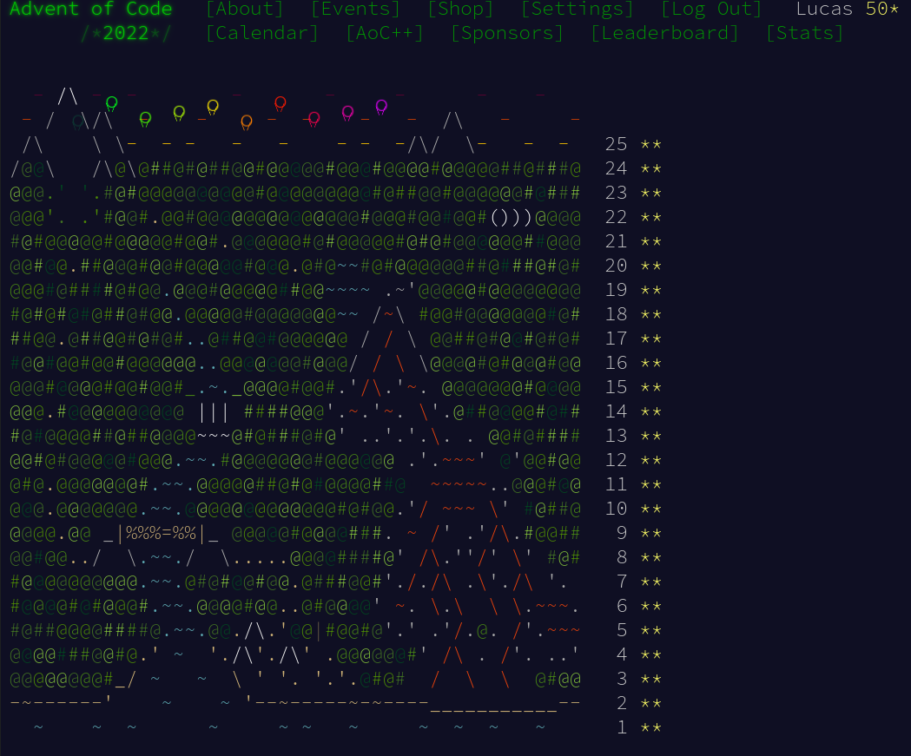

# Advent-of-code-2022

[Advent of Code](https://adventofcode.com/) is an annual set of Christmas-themed computer programming challenges that follow an Advent calendar. It has been running since 2015

The goal is to solve the exercice the fastest way possible

# Dependencies

The code only need python3.10 to run.

# Code

The code is meant to get the result the fastest way possible. It is not clean and might not work on others people inputs.

# Stars

